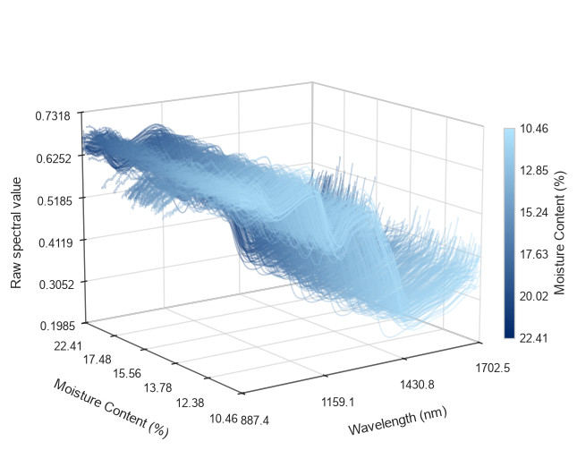

# Figure Code · 科研绘图代码与图集

收集可直接运行的绘图示例，将代码、数据、预览和高清成图放在一起，方便按图查找、复现效果与继续扩展。当前收录 Python / Matplotlib 模拟数据绘图示例。

## 图片速览

### 001 · BMI、孕周与 Y 染色体浓度四联图

[](examples/001-bmi-y-concentration/figures/replicated_figure.png)

山脊密度图、均值与 95% CI、回归散点图和边缘直方图。所有数据均为人工模拟。

[示例说明](examples/001-bmi-y-concentration/README.md) · [Python 代码](examples/001-bmi-y-concentration/replicate_figure.py) · [PNG](examples/001-bmi-y-concentration/figures/replicated_figure.png) · [SVG](examples/001-bmi-y-concentration/figures/replicated_figure.svg) · [PDF](examples/001-bmi-y-concentration/figures/replicated_figure.pdf) · [模拟数据](examples/001-bmi-y-concentration/data/)

### 002 · 原始光谱三维曲线图

[](examples/002-raw-spectra-3d/figures/raw_spectra_3d.png)

640 条模拟光谱、1024 个波段，按模拟含水率排序和着色；支持等距排序展开与实际数值位置两种模式。

[示例说明](examples/002-raw-spectra-3d/README.md) · [Python 代码](examples/002-raw-spectra-3d/plot_spectra_3d.py) · [PNG](examples/002-raw-spectra-3d/figures/raw_spectra_3d.png) · [SVG](examples/002-raw-spectra-3d/figures/raw_spectra_3d.svg) · [PDF](examples/002-raw-spectra-3d/figures/raw_spectra_3d.pdf) · [模拟数据](examples/002-raw-spectra-3d/data/simulated_spectra.csv)

## 快速运行

建议使用 Python 3.10 或更高版本。在仓库根目录运行：

```bash
python -m pip install -r requirements.txt
python examples/001-bmi-y-concentration/replicate_figure.py
```

运行三维光谱示例（额外依赖 pandas）：

```bash
python -m pip install -r examples/002-raw-spectra-3d/requirements.txt
python examples/002-raw-spectra-3d/plot_spectra_3d.py --output-name raw_spectra_3d --formats png svg pdf
```

默认数据与输出路径根据脚本位置解析，与终端当前目录无关。示例 001 会重新生成数据与图片；示例 002 读取随附模拟 CSV，只生成图片。运行会覆盖同名输出。示例 001 的中文显示需要安装微软雅黑、黑体或 Noto Sans CJK SC 等字体；脚本会自动选择可用字体。

## 目录规划

```text
figure-code/
├── README.md                     # 仓库介绍、图集与规则
├── requirements.txt              # 当前示例共用的 Python 依赖
├── .gitignore
└── examples/
    ├── 001-bmi-y-concentration/
    │   ├── README.md             # 图意、数据来源、运行方式、参数说明
    │   ├── replicate_figure.py   # 独立可运行的绘图入口
    │   ├── data/                 # 生成图片所使用的数据
    │   └── figures/              # preview.png 与 PNG / SVG / PDF
    └── 002-raw-spectra-3d/
        ├── README.md
        ├── requirements.txt      # 此示例的额外依赖
        ├── plot_spectra_3d.py
        ├── data/                 # 用户提供的模拟光谱 CSV
        └── figures/              # 预览、重新导出的成图、原有成图
```

## 后续文件存放规则

1. **一图一目录**：新示例放入 `examples/`，下一个目录命名为 `003-topic-name`，编号递增且不复用；英文小写单词以连字符分隔。
2. **文件各归其位**：代码与示例 README 放在示例根目录，数据放入 `data/`，输出图片放入 `figures/`。复杂示例可增加 `src/`；确有必要且允许分享的参考图放入 `reference/`，并注明来源。
3. **统一预览入口**：每个示例提供 `figures/preview.png`，建议宽度约 1000 px；高清 PNG 建议 300 dpi，并提供 SVG 或 PDF。图片文件应提交到仓库，保证 GitHub README 可直接预览。
4. **可以独立复现**：说明 Python 版本、依赖、执行命令及主要参数。固定随机种子；数据与输出路径相对于脚本解析，不使用个人电脑绝对路径。有特殊依赖时添加示例级 `requirements.txt`。
5. **说明数据性质**：区分真实、公开和模拟数据，写明来源、字段、单位及处理方式。模拟数据不能被描述为真实研究结果；真实数据应确认有权公开。
6. **同步图集**：新增示例后，在本 README 的“图片速览”追加缩略图、说明、代码和输出链接。较多示例时可按分布图、回归图、热图等类型分组。
7. **控制仓库体积**：不提交虚拟环境、依赖安装目录、缓存、临时文件或凭据。大型原始数据应放在合适的数据托管位置，并在示例说明中提供获取方式。

## 新示例 README 应包含

- 图的用途、图形类型与预览。
- 数据来源或模拟机制、字段和单位。
- 安装依赖与一条可运行的命令。
- 可调参数，例如随机种子、颜色、样本量和输出尺寸。
- 输出文件说明；涉及统计量时解释区间和误差棒。

## 使用说明

本仓库当前示例用于学习绘图和复现视觉效果，不构成医学结论。参考素材的使用权与来源应在各示例中单独说明。仓库暂未声明开源许可证，公开可见不代表授予任意再分发或商用许可。
