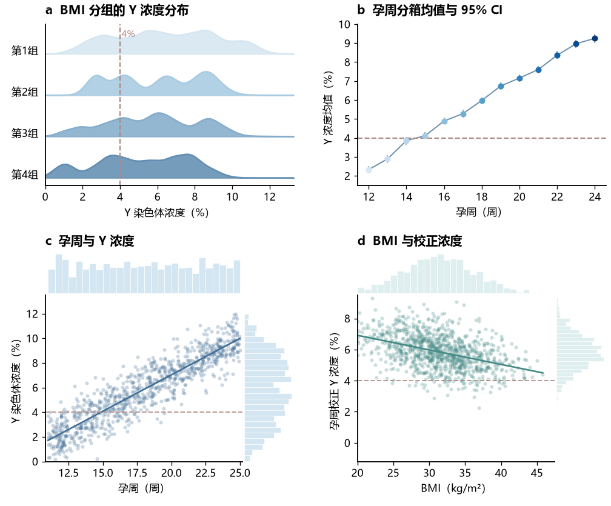

# 001 · BMI、孕周与 Y 染色体浓度四联图

使用 NumPy 生成模拟数据，使用 Matplotlib 复现蓝色、青绿色四联图效果。参考为用户提供的图像；原始参考图片未包含在本目录中。本目录收录本次生成的全部代码、数据与图片。



## 运行

在仓库根目录执行：

```bash
python -m pip install -r requirements.txt
python examples/001-bmi-y-concentration/replicate_figure.py
```

或进入本目录运行 `python replicate_figure.py`。脚本使用无界面的 Agg 后端，结果保存到本目录下，不弹出窗口。

## 面板与模拟机制

| 面板 | 图形 | 数据与统计说明 |
| --- | --- | --- |
| a | 四组山脊密度图 | 四组混合正态分布，过滤超出 0–13.3 的样本；高斯核密度估计，各曲线按自身峰值归一化高度。组号仅为示意，未指定真实 BMI 分界。 |
| b | 孕周均值与误差棒 | 12–24 周，每周 55 个独立模拟样本；误差棒为均值 ± 1.96 × 样本标准差 / √n，即近似 95% 置信区间。 |
| c | 回归散点与边缘直方图 | 900 个样本，孕周均匀分布，浓度为线性正趋势加正态噪声；直线为普通最小二乘拟合。 |
| d | 回归散点与边缘直方图 | BMI 为范围筛选后的正态样本，浓度为线性负趋势加正态噪声；“孕周校正”仅为模拟变量命名，未使用面板 c 数据执行实际校正。 |

四个面板独立模拟，不能视为同一批受试者的联合分析。4% 虚线用于匹配参考图视觉元素，不在此解释其临床意义。回归图没有绘制置信带，也没有进行假设检验。

## 文件

| 文件 | 用途 |
| --- | --- |
| `replicate_figure.py` | 完整绘图代码，随机种子为 `20260907` |
| `data/panel_a.csv` | BMI 组号与模拟 Y 浓度（%） |
| `data/panel_b_raw.csv` | 每个孕周的原始模拟浓度 |
| `data/panel_b_summary.csv` | 孕周、均值、95% CI 半宽、样本数 |
| `data/panel_c.csv` | 孕周与模拟 Y 浓度（%） |
| `data/panel_d.csv` | BMI（kg/m²）与模拟校正浓度（%） |
| `figures/preview.png` | 120 dpi 预览 |
| `figures/replicated_figure.png` | 300 dpi 成图 |
| `figures/replicated_figure.svg` | 矢量图，文字保留为文本 |
| `figures/replicated_figure.pdf` | 矢量 PDF |

CSV 使用 UTF-8 BOM 编码。脚本重复运行会覆盖上述同名数据与图片。

## 调整效果

在代码中修改 `SEED` 可更换模拟数据；`configs` 控制密度曲线；`targets` 控制孕周均值趋势；`scatter_marginals` 控制散点透明度和边缘直方图。画布尺寸由 `figsize` 控制，输出分辨率由 `savefig` 的 `dpi` 控制。不同依赖版本与字体可能造成细小的显示差异。
